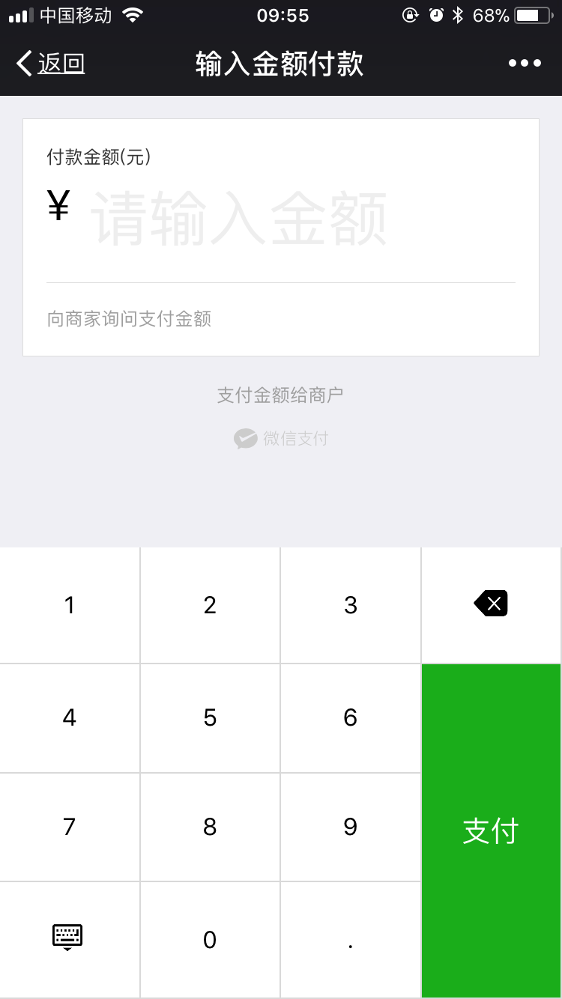

### IJPay-Demo

>主分支为JFinal版本Demo，SpringBoot分支为SpringBoot版本的Demo [如何使用?](https://javen205.gitee.io/ijpay/doc/IJPay-Demo.html)

[![License][licensesvg]][license]

**特别说明：** 不依赖任何第三方 mvc 框架，仅仅作为工具使用简单快速完成支付模块的开发，可轻松嵌入到任何系统里。

Gitee：[http://gitee.com/Javen205/IJPay](http://gitee.com/Javen205/IJPay)

GitHub：[https://github.com/Javen205/IJPay](https://github.com/Javen205/IJPay)

- IJPay是[JPay](https://github.com/Javen205/JPay)后台接口SDK不依赖任何第三方 mvc 框架，仅仅作为工具使用简单快速完成支付模块的开发，可轻松嵌入到任何系统里。
- [JPay](https://github.com/Javen205/JPay) 是简易而不简单的Android 支付SDK，JPay是对微信App支付、支付宝App支付的二次封装,对外提供一个相对简单的接口以及支付结果的回调。
- IOS支付SDK，敬请关注。

### 开源推荐

- `TNW` 微信公众号开发脚手架：<https://gitee.com/javen205/TNW>
- `IJPay` 让支付触手可及：<https://gitee.com/javen205/IJPay>
- SpringBoot 微服务高效开发 `mica` 工具集：<https://gitee.com/596392912/mica>
- `Avue` 一款基于 vue 可配置化的神奇框架：<https://gitee.com/smallweigit/avue>
- `pig` 宇宙最强微服务（架构师必备）：<https://gitee.com/log4j/pig>
- `SpringBlade` 完整的线上解决方案（企业开发必备）：<https://gitee.com/smallc/SpringBlade>

### 接入文档

[IJPay 接入文档，如有疑问请发issues](https://javen205.gitee.io/IJPay)

**使用Demo之前请熟读以下文章**

[配置应用环境](https://javen205.gitee.io/ijpay/doc/ijpay/alipay/alipay-config.html)

[IJPay 支付宝初始化](https://javen205.gitee.io/ijpay/doc/ijpay/alipay/alipay-init.html)

### 联系方式

[IJPay交流圈-需要帮助点击这里](https://javen205.gitee.io/ijpay/doc/contact.html)

[qq0groupsvg]: https://img.shields.io/badge/QQ群-148540125-fba7f9.svg
[qq0group]: http://shang.qq.com/wpa/qunwpa?idkey=5005dbbee62dac64b34fedc9ff73511762da5d02642a1ef526522fb2e07852dd

[licensesvg]: https://img.shields.io/badge/License-Apache--2.0-brightgreen.svg
[license]: https://www.apache.org/licenses/LICENSE-2.0

### 贡献代码

最后如果该库对你有帮助不妨右上角点点Star,我更喜欢你 Fork PR 成为项目贡献者.

### 效果图

- 微信支付效果图

|    微信商户下各种支付演示Demo     |     微信服务商户下各种支付演示Demo     |     支付键盘     |
| :--------------------: | :-----------------------: | :-----------------------: |
|  |  | |

- 支付宝测试截图

  |           支付宝测试截图一            |           支付宝测试截图二            |           支付宝测试截图三            |
  | :---------------------------: | :---------------------------: | :---------------------------: |
  |  |  |  |

### 鸣谢

排名不分先后

1. [jfinal](http://git.oschina.net/jfinal/jfinal)
2. [jfinal-weixin](http://git.oschina.net/jfinal/jfinal-weixin)
3. [Layer](http://layer.layui.com/)
4. [weui](https://github.com/weui/weui)
5. [jquery-weui](https://github.com/lihongxun945/jquery-weui/)
6. [zxing](https://github.com/zxing/zxing)
7. [wepayui](https://github.com/wepayui/wepayui)
8. 感谢第三方公司提供微信商户平台测试