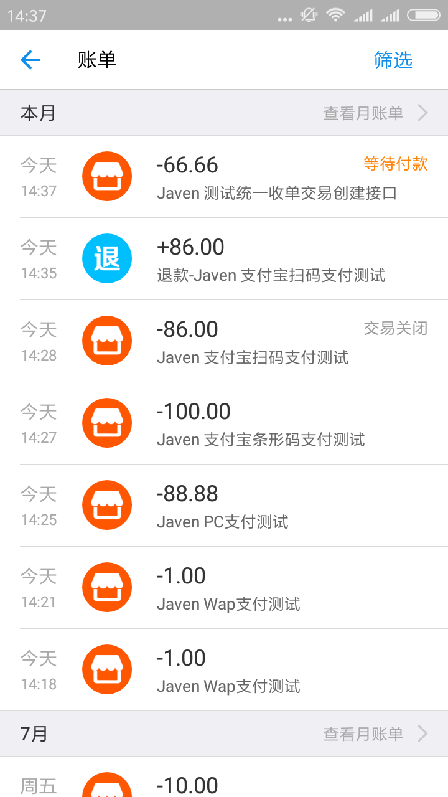
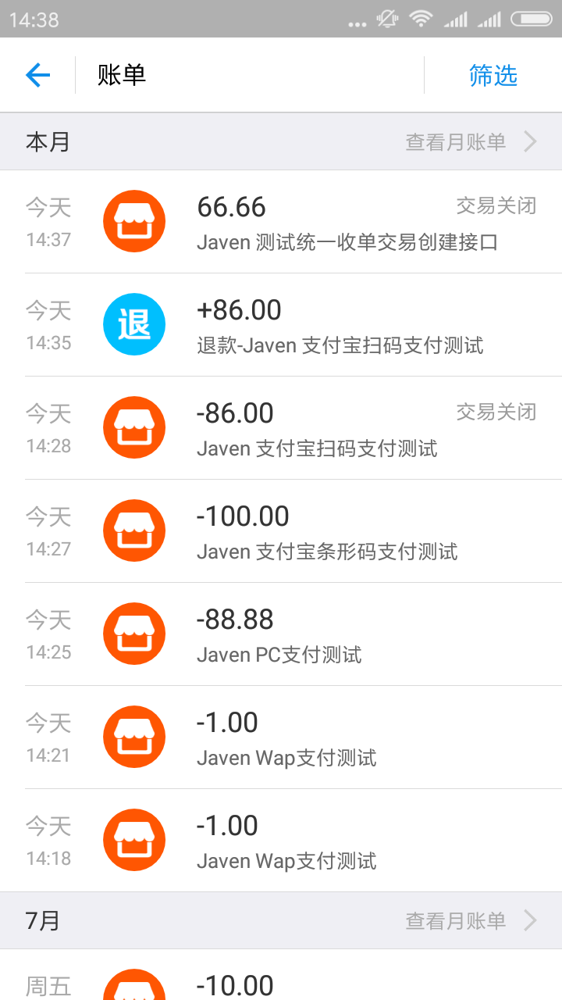
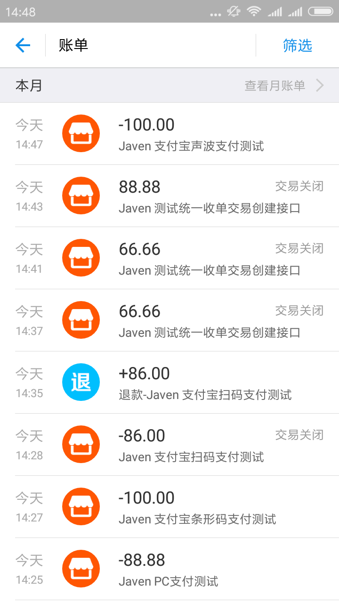

# 🔥  IJPay Spring-Boot Demo

[![License][licensesvg]][license]
[](https://maven-badges.herokuapp.com/maven-central/com.github.javen205/IJPay)


GitHub：[https://github.com/Javen205/IJPay](https://github.com/Javen205/IJPay)

Gitee：[http://gitee.com/Javen205/IJPay](http://gitee.com/Javen205/IJPay)

Demo:

[https://github.com/Javen205/IJPay-Demo](https://github.com/Javen205/IJPay-Demo)

[https://gitee.com/Javen205/IJPay-Demo](https://gitee.com/Javen205/IJPay-Demo)

- [JPay](https://gitee.com/Javen205/JPay) 简易而不简单的Android 支付SDK，JPay是对微信App支付、支付宝App支付、银联支付App支付的二次封装,对外提供一个相对简单的接口以及支付结果的回调

- IJPay 让支付触手可及，封装了微信支付、支付宝支付、银联支付常用的支付方式以及各种常用的接口


### 效果图

- 微信支付效果图

|    微信商户下各种支付演示Demo     |     微信服务商户下各种支付演示Demo     |
| :--------------------: | :-----------------------: |
|  |  |


- 支付宝测试截图

  |           支付宝测试截图一            |           支付宝测试截图二            |           支付宝测试截图三            |
  | :---------------------------: | :---------------------------: | :---------------------------: |
  |  |  |  |


### 功能列表

  > 微信支付

  - 普通商户版
    - [x] 刷卡支付
    - [x] 公众号支付
    - [x] 扫码支付模式一
    - [x] 扫码支付模式二
    - [x] APP支付
    - [x] 现金红包
    - [x] 企业付款
    - [x] 退款接口
    - [x] 查询退款
    - [x] 查询订单
    - [x] 关闭订单
    - [x] 下载对账单
    - [x] 转换短链接


  - 服务商版
    - [x] 刷卡支付
    - [x] 公众号支付
    - [x] 扫码支付
    - [x] 现金红包
    - [x] 退款接口
    - [x] 查询退款
    - [x] 查询订单
    - [x] 关闭订单
    - [x] 下载对账单
    - [x] 转换短链接


   > 支付宝支付


   - [x] 电脑网站支付
   - [x] 手机网站支付
   - [x] APP支付
   - [x] 条码支付(刷卡支付)
   - [x] 声波支付
   - [x] 扫码支付
   - [x] 交易查询接口
   - [x] 交易撤销接口
   - [x] 交易退款接口
   - [x] 退款查询接口
   - [x] 单笔转账到支付宝账户接口
   - [x] 查询转账订单接口
   - [x] 查询对账单下载地址接口
   - [x] 交易结算接口
   - [x] 交易保障接口

   > 银联支付

待接入


### 微信参考资料

- [Android版-微信APP支付](http://blog.csdn.net/zyw_java/article/details/54024232)
- [微信开发之现金红包](http://blog.csdn.net/zyw_java/article/details/54024211)
- [微信开发之刷卡支付](http://blog.csdn.net/zyw_java/article/details/54024198)
- [微信开发之扫码支付](http://blog.csdn.net/zyw_java/article/details/54024162)
- [微信开发之公众号支付](http://blog.csdn.net/zyw_java/article/details/54023968)

### 支付宝参考资料

- [支付宝支付-PC电脑网站支付](http://blog.csdn.net/zyw_java/article/details/71970972)

- [支付宝支付-支付宝常用的12个接口封装、异步通知](http://blog.csdn.net/zyw_java/article/details/71844328)

- [支付宝支付-提现到个人支付宝](http://blog.csdn.net/zyw_java/article/details/71598711)

- [支付宝支付-扫码支付](http://blog.csdn.net/zyw_java/article/details/71437269)

- [支付宝支付-刷卡支付(条码支付)](http://blog.csdn.net/zyw_java/article/details/71372789)

- [支付宝Wap支付你了解多少？](http://blog.csdn.net/zyw_java/article/details/54024253)

- [Android版-支付宝APP支付](http://blog.csdn.net/zyw_java/article/details/54024238)

- [一张二维码集成微信、支付宝支付](http://blog.csdn.net/zyw_java/article/details/54630880)


### 鸣谢

排名不分先后

1. [spring-boot](http://projects.spring.io/spring-boot/#quick-start)
2. [weixin-java-tools](https://github.com/wechat-group/weixin-java-tools)
3. [Layer](http://layer.layui.com/)
4. [weui](https://github.com/weui/weui)
5. [jquery-weui](https://github.com/lihongxun945/jquery-weui/)
6. [zxing](https://github.com/zxing/zxing)
7. [wepayui](https://github.com/wepayui/wepayui)
8. 感谢第三方公司提供微信商户平台测试


### 联系方式


[![QQ0Group][qq0groupsvg]][qq0group]

Email:javendev@126.com


[qq0groupsvg]: https://img.shields.io/badge/QQ群-148540125-fba7f9.svg
[qq0group]: http://qm.qq.com/cgi-bin/qm/qr?k=7Vs725Nh0KVAsGFCodeGyMQTLYuEHeXy


[licensesvg]: https://img.shields.io/badge/License-Apache--2.0-brightgreen.svg
[license]: https://www.apache.org/licenses/LICENSE-2.0

### 最后如果该库对你有帮助不妨对右上角点点 Star 对我支持 ， 感谢万分 ! 当然我更喜欢你 Fork PR 成为项目贡献者 . [IJPay](https://github.com/Javen205/IJPay)  

>如果对你有帮助,请任意打赏支持


## License
```
Copyright (C)  Javen205(https://github.com/Javen205/IJPay)

Licensed under the Apache License, Version 2.0 (the "License");
you may not use this file except in compliance with the License.
You may obtain a copy of the License at

     http://www.apache.org/licenses/LICENSE-2.0

Unless required by applicable law or agreed to in writing, software
distributed under the License is distributed on an "AS IS" BASIS,
WITHOUT WARRANTIES OR CONDITIONS OF ANY KIND, either express or implied.
See the License for the specific language governing permissions and
limitations under the License.
```
